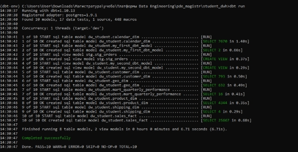
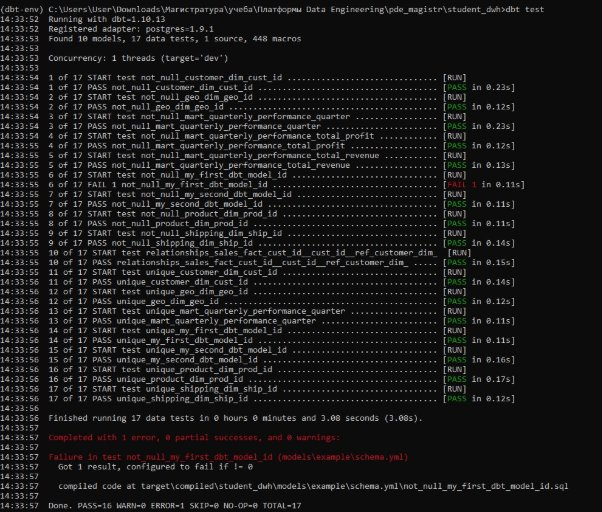
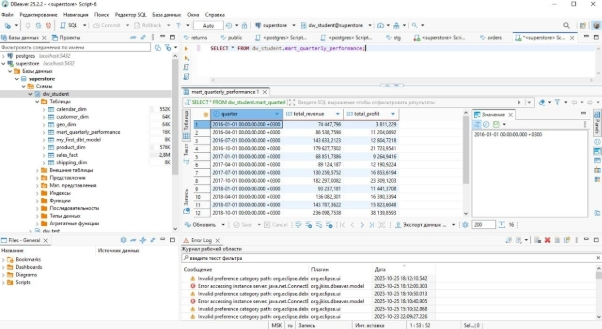

Проект: student\_dwh 

Выполнил(а): Бурлов Василий Тимофеевич Группа: БД-251м 

**Граф зависимостей:** 

**Код модели stg\_orders.sql:** 

-- models/staging/stg\_orders.sql 

-- Эта модель читает данные из исходной таблицы stg.orders, 

-- приводит их к нужным типам и исправляет ошибку с почтовым кодом. 

-- Все последующие модели будут ссылаться на эту, а не на исходную таблицу. 

SELECT 

`    `-- Приводим все к нижнему регистру для консистентности в dbt 

`    `"order\_id", 

`    `("order\_date")::date as order\_date, 

`    `("ship\_date")::date as ship\_date, 

`    `"ship\_mode", 

`    `"customer\_id", 

`    `"customer\_name", 

`    `"segment", 

`    `"country", 

`    `"city", 

`    `"state", 

`    `-- Исправляем проблему с Burlington прямо здесь, один раз и навсегда 

`    `CASE 

`        `WHEN "city" = 'Burlington' AND "postal\_code" IS NULL THEN '05401' 

`        `ELSE "postal\_code" 

`    `END as postal\_code, 

`    `"region", 

`    `"product\_id", 

`    `"category", 

`    `"subcategory" as sub\_category, -- переименовываем для соответствия     "product\_name", 

`    `"sales", 

`    `"quantity", 

`    `"discount", 

`    `"profit" 

FROM {{ source('stg', 'orders') }} 

**Код модели sales\_fact.sql:** 

-- Создает таблицу фактов, объединяя все измерения 

SELECT 

`    `-- Суррогатные ключи из измерений 

`    `cd.cust\_id, 

`    `pd.prod\_id, 

`    `sd.ship\_id, 

`    `gd.geo\_id, 

`    `-- Ключи для календаря 

`    `to\_char(o.order\_date, 'yyyymmdd')::int AS order\_date\_id, 

`    `to\_char(o.ship\_date, 'yyyymmdd')::int AS ship\_date\_id, 

`    `-- Бизнес-ключ и метрики 

`    `o.order\_id, 

`    `o.sales, 

`    `o.profit, 

`    `o.quantity, 

`    `o.discount 

FROM {{ ref('stg\_orders') }} AS o 

LEFT JOIN {{ ref('customer\_dim') }} AS cd ON o.customer\_id = cd.customer\_id 

LEFT JOIN {{ ref('product\_dim') }} AS pd ON o.product\_id = pd.product\_id 

LEFT JOIN {{ ref('shipping\_dim') }} AS sd ON o.ship\_mode = sd.ship\_mode 

LEFT JOIN {{ ref('geo\_dim') }} AS gd ON o.postal\_code = gd.postal\_code AND o.city = gd.city AND o.state = gd.state 

**Код моей индивидуальной mart-модели (mart\_quarterly\_performance - вариант 5):** 

-- models/marts/mart\_quarterly\_performance.sql with orders as ( 

`    `select \* 

`    `from {{ ref('stg\_orders') }} 

) 

select 

`    `date\_trunc('quarter', order\_date) as quarter,     sum(sales) as total\_revenue, 

`    `sum(profit) as total\_profit 

from orders 

group by 1 

order by 1 

**Файл schema.yml с тестами для всех моделей:** 

\# Путь к файлу: models/marts/schema.yml version: 2 models: 

- name: shipping\_dim 

`    `columns: 

- name: ship\_id 

`        `tests: 

- unique 
- not\_null 
- name: customer\_dim 

`    `columns: 

- name: cust\_id 

`        `tests: 

- unique 
- not\_null 
- name: geo\_dim 

`    `columns: 

- name: geo\_id 

`        `tests: 

- unique 
- not\_null 
- name: product\_dim 

`    `columns: 

- name: prod\_id 

`        `tests: 

- unique 
- not\_null 
- name: sales\_fact 

`    `columns: 

- name: cust\_id 

`        `tests: 

- relationships: 

`              `arguments:   

`                `to: ref('customer\_dim')                 field: cust\_id 

- name: mart\_quarterly\_performance 

`    `description: "Суммарная выручка и прибыль по кварталам"     columns: 

- name: quarter 

`        `tests: 

- not\_null 
- unique 
- name: total\_revenue 

`        `tests: 

- not\_null 
- name: total\_profit 

`        `tests: 

- not\_null 

**Скриншот успешного выполнения dbt run и dbt test для проекта student\_dwh:** 

**Скриншот с данными из моей индивидуальной mart-модели (DBeaver):** 

**Выводы:** 

Использование dbt для реализации DWH имеет несколько ключевых преимуществ по сравнению с ручным написанием DDL/DML скриптов: 

**Структурированность и повторяемость**: dbt позволяет организовать проект в виде моделей, источников и макросов, что упрощает поддержку и масштабирование. 

**Автоматизация тестирования данных**: встроенные тесты (unique, not\_null, relationships) помогают проверять качество данных на каждом этапе, уменьшая риск ошибок. 

**Документирование и lineage**: dbt автоматически генерирует документацию и граф зависимостей моделей, что облегчает понимание потока данных и коммуникацию с командой. 

**Модульность**: модели можно легко комбинировать для разных аналитических задач, без дублирования SQL-кода. 

**Ускорение разработки**: разработка через dbt снижает количество ручной работы, ускоряет развертывание новых моделей и улучшает контроль версий с помощью Git. 

В целом, dbt делает процесс построения DWH более прозрачным, управляемым и надежным по сравнению с ручным созданием таблиц и написанием SQL-скриптов. 
