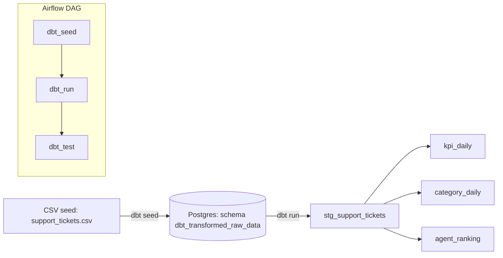

# Support Analytics — Airflow + dbt (Docker)

## Цель работы
Построить минимальный ELT‑конвейер для аналитики службы поддержки на датасете имитации заявок, автоматизировать загрузку и преобразования с помощью **Airflow** и **dbt**, получить витрины для метрик и отчётов.

## Выбранный вариант выполнения
**Вариант:** Docker.  
**Почему:**
- локальная среда без аккаунта в облаке;
- быстрый старт (всё поднимается `docker compose`);
- удобно проводить дебаг dbt и Airflow в одних контейнерах.

## Архитектура решения



- **Хранилище:** PostgreSQL (БД `warehouse`)
- **Схемы:**
  - `dbt_transformed_raw_data` — сырые таблицы/сиды;
  - `dbt_transformed_dbt_transformed` — представления (витрины).

### Витрины
- `stg_support_tickets` — очищение/приведение типов;
- `kpi_daily(date, tickets, avg_resolution_hours, avg_first_response_hours, avg_satisfaction, repeat_rate)`;
- `category_daily(date, category, tickets)`;
- `agent_ranking(agent_id, tickets, avg_resolution_hours, avg_satisfaction, repeat_rate, score)` — свод по агентам с интегральным скором.

**Данные:** Bitext *Sample Customer Service* (training/validation/testing CSV). В работе использовался столбец `category` (и сопутствующие поля), из него строились агрегаты.

## Структура репозитория

```
.
├─ docker-compose.yml
├─ dags/
│   └─ support_analytics_dag.py     # DAG: dbt_seed → dbt_run → dbt_test
├─ dbt/
│   └─ support_analytics/
│       ├─ dbt_project.yml
│       ├─ models/
│       │   ├─ staging/stg_support_tickets.sql
│       │   └─ marts/{kpi_daily.sql, category_daily.sql, agent_ranking.sql}
│       ├─ seeds/support_tickets.csv  # объединённый seed из CSV
│       └─ .dbt/profiles.yml          # профиль подключения к Postgres
└─ screenshots/
    ├─ airflow_dag_success.png        # граф DAG
    └─ dbeaver_kpi_daily.png          # витрина в DBeaver/pgAdmin
```
## Инструкция по запуску

### 1) Предварительно
- Установить Docker Desktop (WSL2 включён).
- Порт 5432 должен быть проброшен наружу (в compose: `ports: ["5432:5432"]` для сервиса postgres).

### 2) Поднять инфраструктуру
```bash
docker compose down -v
docker compose up -d
```

> Если `dbt debug` ругается на отсутствие `git`, установите его в контейнерах Airflow:
```bash
docker compose exec --user root airflow-webserver bash -lc "apt-get update && apt-get install -y git && rm -rf /var/lib/apt/lists/*"
docker compose exec --user root airflow-scheduler  bash -lc "apt-get update && apt-get install -y git && rm -rf /var/lib/apt/lists/*"
```

### 3) Проверить dbt из контейнера
```bash
docker compose exec airflow-webserver bash -lc "cd /opt/airflow/dbt/support_analytics && dbt debug && dbt seed && dbt run && dbt test"
```

### 4) Запустить DAG в Airflow
- Открыть `http://localhost:8080` (логин/пароль: `admin/admin`).
- Найти DAG `support_analytics_dbt`, **включить** и **Trigger DAG**.
- Убедиться, что задачи `dbt_seed → dbt_run → dbt_test` зелёные.

### 5) Проверка витрин (DBeaver/pgAdmin)
Подключение: `host=localhost, port=5432, db=warehouse, user=postgres, pass=postgres`.  
Схема: `dbt_transformed_dbt_transformed` → открыть `kpi_daily`, `category_daily`, `agent_ranking`.

#### Примеры запросов
```sql
-- использовать схему с витринами
SET search_path TO dbt_transformed_dbt_transformed;

-- последние 20 дней KPI
SELECT * FROM kpi_daily ORDER BY date DESC LIMIT 20;

-- категории за апрель 2024
SELECT category, SUM(tickets) AS tickets_apr_2024
FROM category_daily
WHERE date >= DATE '2024-04-01' AND date < DATE '2024-05-01'
GROUP BY category
ORDER BY tickets_apr_2024 DESC;

-- топ-агенты по скору
SELECT * FROM agent_ranking
ORDER BY score DESC NULLS LAST
LIMIT 10;
```
## Выводы
Связка **Airflow + dbt** даёт чёткое разделение задач:
- Airflow — оркестрация, расписания, зависимости, ретраи и мониторинг;
- dbt — декларативные SQL‑модели, документация, тесты качества данных (`not_null`, `unique`), управление схемами/артефактами.

В рамках проекта получены ежедневные KPI (`kpi_daily`), распределение по категориям (`category_daily`) и рейтинг специалистов (`agent_ranking`) — готовые источники для дашбордов.

**Плюсы Docker‑варианта:** быстрый локальный старт, независимость от облака, простота отладки.  
**Минусы:** нет управляемых сервисов и автоскейлинга; доступность/бэкапы нужно продумывать самостоятельно.

